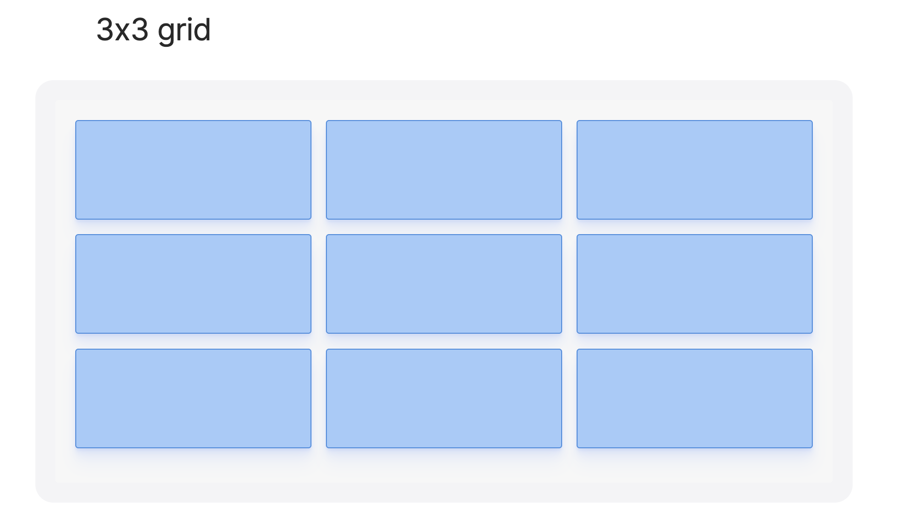
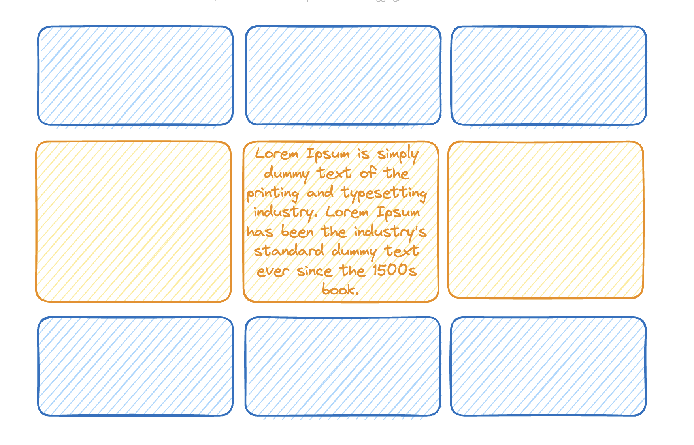
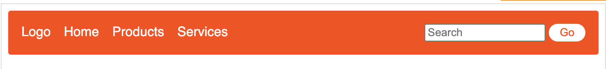
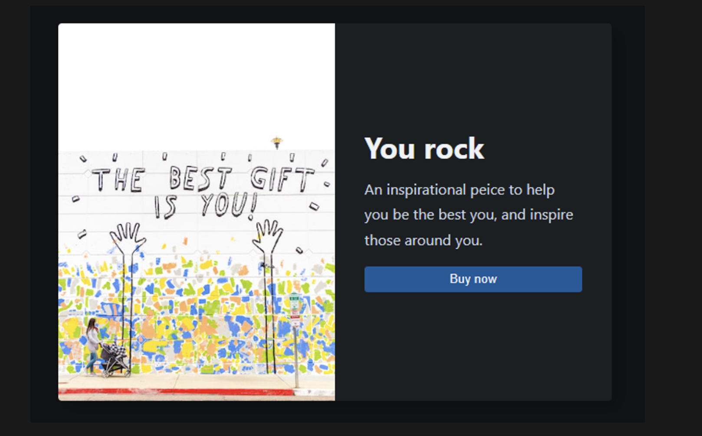
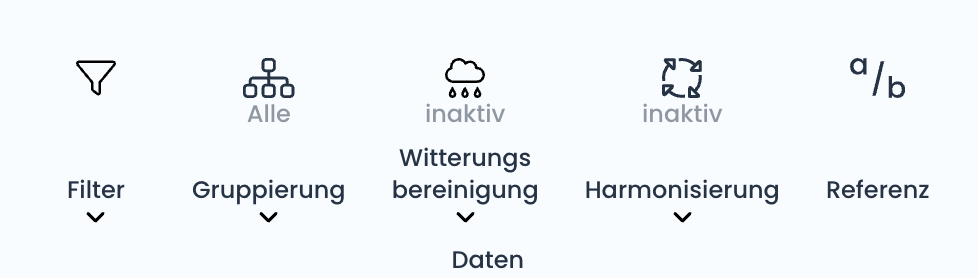
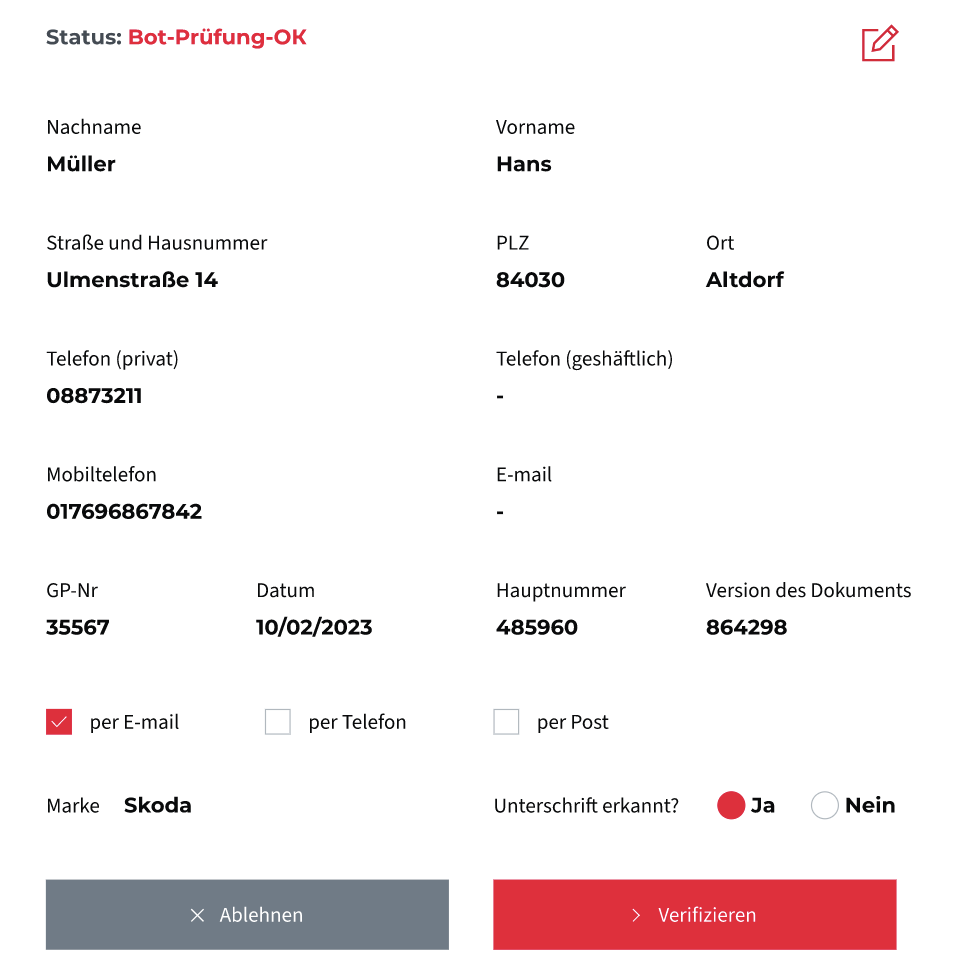
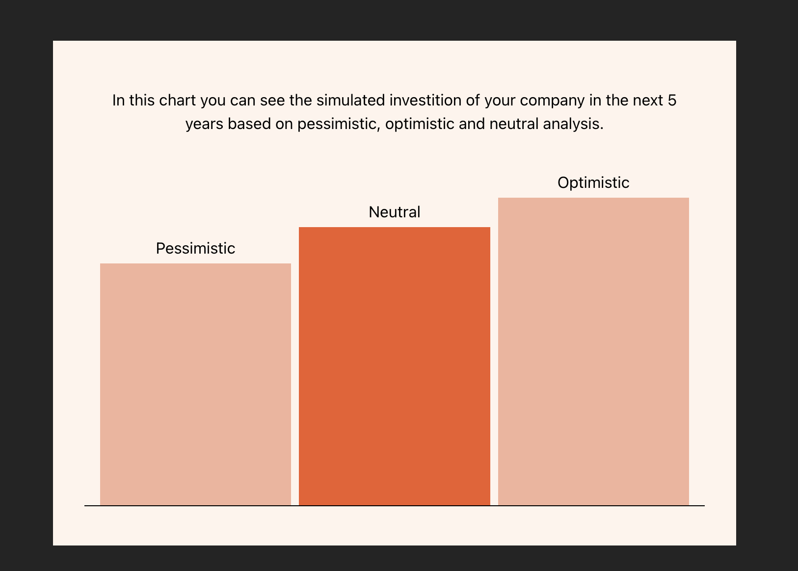
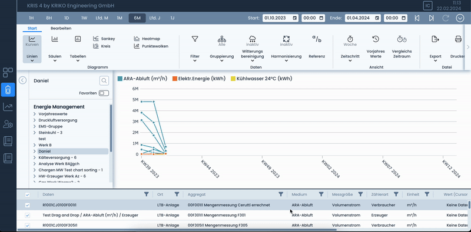

# CSS Workshop - Box model & Flex

## Topics
- [ ] Displays - block, inline, inline-block
- [ ] Box model
  - [ ] Border
  - [ ] Padding
  - [ ] Margin
- [ ] Flex
  - [ ] Parent
    - [ ] Flex container & direction
    - [ ] justify-content
    - [ ] align-items
    - [ ] justify-items
    - [ ] gap
  - [ ] Child
    - [ ] Order
    - [ ] grow
    - [ ] shrink


## Resourcess
- Simple flex layouts https://tobiasahlin.com/blog/common-flexbox-patterns/

## Exercises

### 1) Box model - simple grid
Create a 3 x 3 grid with boxes by using only display and box model, no flex or grid allowed!


 
---

### 2) Box model - same height grid
Create another 3x3 grid with display & box model only, where on the second row the middle element should have some lorem ipsuim text inside of it. This element will be taller than the rest - the elements around it should be of the same height!



---

### 3) Box model - Navigation
Create a simple navigation bar again only with display and box model



---

### 4) Centered card
With the help of Flex make a card component. We have an image on the left side and text on the right. The text should be centered on the Y-axis of the image. Set meaningfull max-width/height of the whole component so it's not exploding on the page and try to keep the proportions.



---

### 5) Kriko's navigation
You need to recreate a part of the Kriko project's navigation - as you can see a nav item can have a different set of texts and different number of lines. The items should be positioned in such a way, that the icon and the hint text should always be on top, while the label of the nav item and the chevron icon should always be set to the bottom!


---

### 6) DSE Form
Recreate the form layour of the DSE Project by using flex. Try and make it responsive!



--- 

### 7) Bar chart
You need to create a "simple" bar chart with flex. The chart should show 3 bars in ascending order. At the top of the chart add labels for the type of the chart - `"pessimistic", "neutral", "optimistic"`. The label should be positioned at the top of each corresponding bar.

These colors are used in the demo
```
--clr-primary: #f05b28;
--clr-primary-light: #f4b29b;
--clr-secondary: #fff4ec;
```



---

### 8) Kriko sidebars
Under the `/exercise-sidebars` folder you'll find a small react app using react sliders and recharts. The concept is simple - you have 2 types of layours: Layout A) is 1 horizontal and 1 vertical slider; Layout B) is 2 horizontal sliders. In the middle section you have your "content" - a label of the charts and 2 dummy charts. With the help of flexbox you need to make you content panel to always take the whole available width and height, whatever the selected layout is. The 2 charts should be positioned one under another. 

Here's a real example of the behavior:

